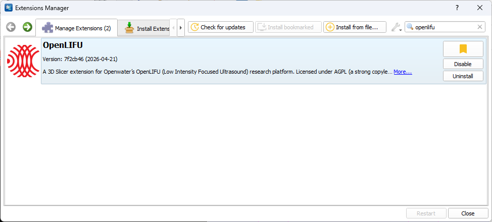

# Slicer Open-LIFU (Advanced Users)

For day-to-day clinical-style planning, the
[Open-LIFU Desktop Application](software.md#open-lifu-desktop-application)
provides the safest path. **Slicer Open-LIFU** is the same set of modules
exposed directly inside vanilla 3D Slicer, with fewer guardrails — intended
for advanced research workflows.

!!! warning "Reduced guardrails outside the Desktop App"
    Only advanced users should use the Slicer modules directly. Fewer
    safety and permission restrictions apply to system configuration and
    operation than in the Desktop Application. Because the underlying data
    objects are more explicitly exposed and mutable, it is possible to
    configure the system to operate outside of bounds for system safety,
    integrity, and performance.

    **Running Slicer Open-LIFU does not restrict or prevent accidental
    sonications.** A sonication solution can still be sent to the
    transducer even if the parameters fall outside safe or acceptable
    zones. Users are responsible for understanding the sonication protocol
    parameters and the effects they may have on the subject.

## Install Slicer with the Open-LIFU extension

To access the full set of advanced tools, install vanilla Slicer and the
Open-LIFU extension directly. This allows the use of external Slicer
functions to modify the volumes, meshes, and transformations used during
sonication planning.

### Download Slicer

1. Download the latest stable release of Slicer from
   [download.slicer.org](https://download.slicer.org/).
2. **On Windows:** during installation, ensure that **there are no spaces**
   in the installation path. (`C:\Users\Username\AppData\Local\slicer.org\3D Slicer 5.10.0` will fail; `C:\Users\Username\AppData\Local\slicer.org\3DSlicer5.10.0` is fine.)

### Install the SlicerOpenLIFU extension

The SlicerOpenLIFU extension is in the Slicer Extensions Manager.

1. Launch Slicer.
2. Navigate to **View** in the top-left corner.
3. Click **Manage Extensions**.
4. Type "Open-LIFU" in the search bar. Locate the Open-LIFU extension and
   click **Install**.

<figure markdown="span">
  { width="800" }
  <figcaption>Figure 15 — Use the Slicer Extensions Manager to install OpenLIFU (ER-00015 Rev A, p. 31).</figcaption>
</figure>

5. Once installation completes, **restart** the application for the
   extension to be enabled.
6. If you need an older version, go to the
   [`SlicerOpenLIFU` repository](https://github.com/OpenwaterHealth/SlicerOpenLIFU)
   and follow the manual install instructions. You **must uninstall any
   previous version** of the Open-LIFU extension and restart Slicer before
   installing a new one.

To perform offline mesh reconstruction instead of using the Openwater
cloud reconstruction service, you also need to install **Meshroom** and
add it to your system `PATH`. See the
[`openlifu-python` README](https://github.com/OpenwaterHealth/OpenLIFU-python/blob/main/README.rst#installing-meshroom)
for details.

## Slicer modules at a glance

The Slicer Open-LIFU extension exposes additional functionality for each
module that is otherwise disabled in the Desktop application.

| Module | Description |
|---|---|
| **Data Management** | Set up and configure database directories for accessing user and subject data used during a session. |
| **Sonication Protocol** | Create custom sonication protocols using the Protocol Configuration Wizard. |
| **Pre-Planning** | Place targets within a body region (e.g., the brain) and suggest transducer placement options to ensure the target lies within the focused beam pathway. |
| **Transducer Localization** | Use photogrammetry to map the virtual transducer to the physical transducer by co-registering an MRI with a photoscan. |
| **Sonication Planning** | Compute the sonication solution from all sonication inputs and visualize the activation volume to ensure the target lands within the focal spot. |
| **Sonication** | Monitor the progress and delivery of the full treatment to the prescribed target, usually consisting of multiple sonications. |

## Workflow modes

The Slicer modules support two workflow modes:

- **Prescribed Workflow (Session)** — load a predefined session containing
  specific Sonication Protocols, Transducers, Volumes, and Targets. These
  parameters are *locked* throughout the workflow to ensure consistency
  and to guide the user through a prescribed path.
- **Open Workflow (No Session)** — input and modify data independently
  within each module. Ideal for testing specific features, custom
  workflows, or iterative functionality where parameters need to change
  between stages.

---

## Data Management

The **Open-LIFU Data** page introduces a section to view the data objects
associated with a session. The user may define (create) a session by
selecting a subject, sonication protocol, transducer, MRI volume, fiducial
landmarks, and photoscan. These all then get saved to the session.

<figure markdown="span">
  { width="500" }
  <figcaption>Figure 16 — Data Management module: user-defined data inputs that compose a session (ER-00015 Rev A, p. 33).</figcaption>
</figure>

When working without a session, you can load each object independently
using the buttons in the OpenLIFU Objects panel. When working *with* a
session, the loaded objects are pre-populated from the session definition
and reflected in the loaded-objects table.

## Sonication Protocol

The **Sonication Protocol** module is where users define the pulse and
sequence parameters that govern a sonication. The editor matches the
functionality in the Desktop application.

<figure markdown="span">
  { width="500" }
  <figcaption>Figure 17 — Sonication Protocol module: pulse and sequence parameters for a sonication.</figcaption>
</figure>

## Pre-planning

The **Pre-planning** module is the interface for placing targets and
identifying appropriate transducer placement and orientation options based
on the selected target location. When the user is not proceeding with a
session, the input objects to the Virtual Fitting algorithm may be selected
from any objects imported during the previous Open-LIFU Data step. Volumes
can point to any volume imported into Slicer (DICOM, NRRD, processed
volumes, etc.). Targets can be imported as any markup point file type. The
Protocol and Transducer files are Open-LIFU-specific and must be loaded
from files provided to the user.

<figure markdown="span">
  { width="500" }
  <figcaption>Figure 18 — Pre-planning module: place targets, run virtual fitting, and review approved transducer placements.</figcaption>
</figure>

Multiple targets can be placed and locked. The desired target can then be
selected for determining the initial transducer placement.

## Transducer Localization

The **Transducer Localization** module is the main interface for
co-registering a photogrammetry scan to a segmented volume (e.g., an MRI).
The user can complete this through online or offline reconstruction, or
manually upload a photocollection or pre-reconstructed photogrammetry
scan from local disk via the **Browse** button. Manually uploaded
photogrammetry scans **must be in `.obj` format**.

### Continuing with a session

<figure markdown="span">
  ![Subject Photoscan Creator module with a session active: Photocollection Scan ID 5FSWC245 with a refresh button and QR code; Transfer from Android App or Browse buttons; Generate Photoscan Locally section with Start Photoscan Generation or Browse buttons; greyed-out Protocol (Neuromodulation Demo), Volume (MRI), Transducer (OpenLIFU 2x 400 kHz EVT1) dropdowns reflecting the active session; Photoscan ID 1568_0; Selected Target: Target; Virtual Fit: Virtual Fit 8; Preview Photoscan and Run transducer localization buttons; "transducer localization is approved for the following photoscans: 83996031_0".](images/figure-19-transducer-localization-session.png){ width="500" }
  <figcaption>Figure 19 — Transducer Localization with a session: scan the QR code with the Android photogrammetry app to streamline data transfer.</figcaption>
</figure>

Click the QR code and scan it using the photogrammetry phone app to
streamline entering the data into the phone app.

### Continuing without a session

If the user has decided to continue without selecting a session and has
manually uploaded multiple data objects in the Open-LIFU Data section, the
user is able to select from those objects in this section. The user can
instantly alternate between various imported data objects and test the
transducer localization accordingly.

<figure markdown="span">
  { width="500" }
  <figcaption>Figure 20 — Transducer Localization without a session: alternate between data objects to test localization.</figcaption>
</figure>

## Sonication Planning

The **Sonication Planning** module has fields to choose loaded Protocols,
Transducers, Volumes, and Photoscans for beamforming and simulation.

- **With a session.** The data objects associated with the session are
  pre-selected and greyed out in the data sections. Once selected, users
  may proceed with computing the sonication solution per the session's
  data objects.
- **Without a session.** Users may select from previously uploaded data
  objects. This allows alternation between data objects to instantly test
  the sonication solution against various volumes and photoscans.

<figure markdown="span">
  ![Sonication Planning module: dropdowns for Protocol, Transducer, Volume, and Target with a status note indicating "Virtual fit is approved" and "Transducer localization is approved"; a Solution analysis section with a Global analysis table showing parameters Mainlobe Peak Negative Pressure (0.100 MPa), Mainlobe I_SPPA (0.3 W/cm^2), Mainlobe I_SPTA (0.8 mW/cm^2), Target Position (Lateral) 2.0 mm, Target Position (Elevation) 2.8 mm, Target Position (Axial) 52.9 mm, each with a green checkmark in the Status column.](images/figure-21-sonication-planning.png){ width="500" }
  <figcaption>Figure 21 — Sonication Planning: when all parameters have a green checkmark in the Status column, the sonication protocol has passed the system's internal checks.</figcaption>
</figure>

## Sonication

When the device is powered on and fully connected to the headset, the
connection status is indicated in the user interface.

<figure markdown="span">
  { width="500" }
  <figcaption>Figure 22 — Sonication module: device connection status and run controls.</figcaption>
</figure>

A progress bar tracks completion once the solution is sent to the device.

!!! danger "Solution analysis warnings vs. enforcement"
    The Sonication module **issues a warning for solutions that fail
    analysis checks but does not always prevent execution**. Proceeding
    with these solutions poses a significant risk of hardware damage or
    subject injury and should not be attempted.

    Note: if voltage or duty cycle values fall outside predefined
    thresholds, the software will produce an error and the sonication
    solution will not be sent to the device.

---

## Where the safer path lives

If you are not specifically running advanced research workflows that
require the additional Slicer-module exposure, use the
[Open-LIFU Desktop Application](software.md#open-lifu-desktop-application)
instead. The Desktop App enforces user permissions, locks down workflow
constraints, and prevents many of the misconfigurations possible in the
Slicer-direct path.
