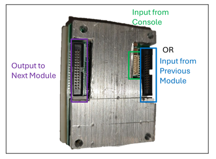
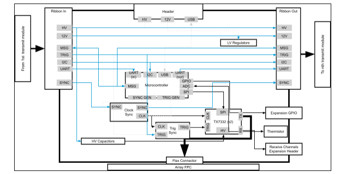
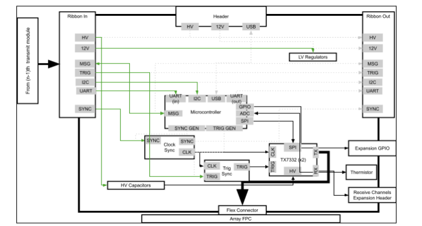

# Open-LIFU Software Development

## Overview

The Open-LIFU software stack comprises **five coordinated layers**:

1. **Embedded firmware** running on the console and transmit modules
2. **Hardware interface SDK** — a lightweight Python library for direct
   device control
3. **Open-LIFU Python toolbox** — core sonication planning algorithms
4. **Slicer extension** — graphical UI modules built on 3D Slicer
5. **Desktop application** — top-level executable that bundles all of the
   above into a guided clinical workflow

Each layer is modular and open-source, allowing for extensibility and
integration. The middle three layers can each be accessed directly through
compatible programs for testing and development.

!!! info "Licensing"
    All Open-LIFU software is licensed under the **AGPL v3**. Hardware
    designs are released under
    [Creative Commons ShareAlike 4.0](https://creativecommons.org/licenses/by-sa/4.0/).
    See [Best Practices → License](best-practices.md#license) for the full
    obligations.

## Software architecture

<figure markdown="span">
  ![Open-LIFU software architecture as a five-layered stack: at the top, OpenLIFU Desktop Application (Windows installable executable, openlifu-desktop-application repo); next, OpenLIFU Slicer Extension (Slicer 5.10 extension catalog, SlicerOpenLIFU); next, OpenLIFU Python Package (Python 3.10+, source code, CUDA-accelerated, openlifu-python); next, OpenLIFU Hardware SDK (Python 3.10+ API, openlifu-sdk); next, OpenLIFU Test App (Windows executable, openlifu-test-app); next, OpenLIFU Console Firmware and Transmit Module Firmware (Verilog and C, openlifu-console-fw and openlifu-transmitter-fw); at the bottom, Console Hardware and Transmit Module Hardware.](images/figure-6-software-architecture.png){ width="800" }
  <figcaption>Figure 6 — Open-LIFU software architecture: a five-layered stack covering desktop application, Slicer extension, Python toolbox, hardware SDK, firmware, and hardware (ER-00015 Rev A, p. 19).</figcaption>
</figure>

A complementary view, showing the application layer alongside the SDK layer,
companion app, and cloud reconstruction service:

<figure markdown="span">
  ![Detailed application architecture showing a User who interacts with three Application Layer surfaces (Custom GUI Application with user permission enforcement and workflow constraints, Slicer Modules with user interface, application data handling, and device control); the SDK Layer (Python) hosts the Python Library which interfaces with K-Wave Binaries, Meshroom Binaries, optional Cloud Sync Service, Local Database, and a Serial API over USB; a Companion App on Android with a Camera and a Cloud Reconstruction Service with reconstruction service and storage cache complete the system.](images/figure-7-application-architecture.png){ width="800" }
  <figcaption>Figure 7 — Application/SDK architecture detail (ER-00015 Rev A). Shows the role of the companion app and cloud reconstruction service alongside the SDK and application layers.</figcaption>
</figure>

## Open-LIFU Desktop Application

The **Open-LIFU Desktop Application** is an executable that provides a
guided workflow for planning and executing sonications. It assigns
user-specific permissions and workflows and is the best way to prevent
accidental system misconfiguration. The desktop application is a custom
build of the open-source 3D Slicer with the Open-LIFU extension installed.

| | |
|---|---|
| **Repository** | [`openlifu-desktop-application`](https://github.com/OpenwaterHealth/openlifu-desktop-application) |
| **Form factor** | Custom 3D Slicer build with bundled OpenLIFU extension |
| **Best for** | Day-to-day planning and execution of sonications |

## Open-LIFU Slicer Extension

The graphical UI elements used by the Desktop Application live in the
**Open-LIFU Slicer Extension**. Advanced users and developers can access
these underlying modules directly from a vanilla 3D Slicer install via the
Extension Manager (search "OpenLIFU"), or by cloning the
[`SlicerOpenLIFU`](https://github.com/OpenwaterHealth/SlicerOpenLIFU)
repository. This allows experimental modification of different steps in the
sonication planning process and incorporation of external Slicer module
functionality.

!!! warning "Reduced guardrails outside the Desktop App"
    Many of the safety guardrails present in the Desktop application are
    not active when the Slicer modules are used directly. See
    [Slicer Modules](slicer.md) for the advanced workflow and its caveats.

## Open-LIFU Python

The core data classes and methods are written in Python and live in the
[`openlifu-python`](https://github.com/OpenwaterHealth/OpenLIFU-python)
repository. Some computationally intensive methods call GPU-accelerated
binaries. These classes can be used directly by experienced developers to
plan and control sonications and are fully customizable. Many classes are
provided as abstract base classes with one or more example-implemented
subclasses, serving as templates for adding customized classes with more
advanced and experimental features.

| | |
|---|---|
| **Repository** | [`openlifu-python`](https://github.com/OpenwaterHealth/OpenLIFU-python) |
| **Framework** | Python |
| **Function** | Orchestrates data management, beamforming computations, acoustic simulation, and field analysis |
| **Platform support** | Windows 11+, Linux |
| **Extensibility** | Open-source and modular (Python 3.10–3.12)<br>Integrates with NumPy, Pandas, Jupyter, and other scientific tools<br>API documentation in `openlifu-python/docs` |

For a guided introduction, see the **[Open-LIFU Quick Start](https://docs.openwater.health/openlifu/)**
or the tutorials repository.

| Repository | Description |
|---|---|
| **Tutorials** | Interactive guides that demonstrate the functionality and usage of the `openlifu` library. Covers the basics of initializing the library and creating fundamental objects, demonstrating how the library connects to and queries databases, and generating analytical solutions and evaluating results. |
| **Test App** | Python-based GUI for the validation and testing of Open-LIFU hardware. |

## Hardware interface SDK

While the Python package provides comprehensive planning tools, the
hardware interface has been split into its own repository so that
applications requiring direct control of the hardware — without the
sonication planning machinery — can be built using only a lightweight
interface layer. This layer runs on the PC and provides device control and
data acquisition.

| | |
|---|---|
| **Repository** | [`openlifu-sdk`](https://github.com/OpenwaterHealth/openlifu-sdk) |
| **Framework** | Python |
| **Function** | Data management<br>Sonication pre-planning ("virtual fitting")<br>Photogrammetric reconstruction using Meshroom<br>Beamforming computation and acoustic simulation using k-Wave<br>Beam field analysis<br>Hardware configuration and control |
| **Platform support** | Windows 11+, Linux |
| **Extensibility** | Open-source and modular (Python 3.10–3.12)<br>Integrates with NumPy, Pandas, Jupyter, and other scientific tools |

### Python library installation (optional)

Direct access to the underlying logic is available via the `openlifu-sdk`
library. For a fuller walk-through with a smoke test and the sample
database, see the
[OpenLIFU-python QUICKSTART](https://github.com/OpenwaterHealth/OpenLIFU-python/blob/main/QUICKSTART.md).

```bash
# 1. Install Python 3.12

# 2. Clone the SDK
git clone https://github.com/OpenwaterHealth/openlifu-sdk.git
cd openlifu-sdk

# 3. Create a virtual environment
# Windows (PowerShell):
python -m venv env
.\env\Scripts\Activate.ps1
# Linux:
python3.12 -m venv env
source env/bin/activate

# 4. Install
pip install -e .
```

## Embedded firmware layer

The Embedded Firmware Layer includes all firmware responsible for the
low-level operation of the system, running on the console and transmit
modules.

| | |
|---|---|
| **Language** | C |
| **Toolchain** | STM32Cube HAL and CMSIS, MISRA C guidelines applied where practical |
| **IDE** | Visual Studio Code |
| **Structure** | Code is organized for readability (clear naming, small functions, single responsibility), safety (defensive programming, bounds checking, explicit initialization), and testability (hardware abstraction, minimal global state). |

To work within this layer:

1. Download the project from Git
2. Open the project within Visual Studio Code
3. Make necessary firmware modifications
4. Build and flash following the per-repo instructions

## Local data storage

In addition to code, Open-LIFU defines structured representations of data
on disk. While the Python code and Slicer modules can handle any data that
is well-constructed into the appropriate class, a `Database` class provides
convenient organization of and access to protocols, subjects, and
transducers, each with nested information. System data is stored locally
in a file tree on disk in a combination of JSON for structured data and
various other file formats for binary data.

The GUI application accesses data from within such a database, while
certain research applications may need to access data objects stored
elsewhere via the lower-level access surfaces.

<figure markdown="span">
  { width="700" }
  <figcaption>Figure 8 — Layered access to Open-LIFU data: each layer is built on top of the one below (ER-00015 Rev A, p. 23).</figcaption>
</figure>

An example of the on-disk database tree (`<…>` represents instance IDs):

```
protocols/
  <pid>/
    <pid>.json
transducers/
  <tid>/
    <tid>.json
    <tid>.surf.obj
    <tid>.body.obj
subjects/
  <sid>/
    volumes/
      <vid>/
        <vid>.json
        <vid>.nii
    sessions/
      <ssid>/
        photocollections/
        photoscans/
        solutions/
        runs/
users/
  <uid>/
    <uid>.json
```

!!! info "Cloud database"
    The cloud database is an active roadmap feature and is in the process
    of being developed.

## Android companion application

Alongside the Open-LIFU PC application is a companion Android app used to
capture photographs for photogrammetric reconstruction (the
"Photocollections" used during transducer localization). See
[Open-LIFU System → Android phone](system.md#android-phone) for supported
device specifications.

## Tools used

| Category | Tools / Platforms |
|---|---|
| Version control | Git + GitHub |
| CI/CD (under development) | GitHub Actions |
| IDEs | VS Code |
| Documentation | Markdown, `.docx` |
| Testing | Oscilloscope, logic analyzers, `unittest` |

## Test & validation utilities

These tools are used in development, manufacturing, and QA workflows.

| | |
|---|---|
| **Repository** | [`openlifu-test-app`](https://github.com/OpenwaterHealth/openlifu-test-app) |
| **Framework** | Python + PyQt6 |
| **Function** | Set high-voltage rails and read back the values<br>Turn on/off the transmit module(s)<br>Perform basic command send/receive verification with the transmitter<br>Toggle the trigger and change the target XYZ coordinates to steer the beam<br>Upgrade firmware |

## Transmit modules

Depending on the configuration, there may be one or more transmit modules
inside the transducer. Each is a PCBA affixed to a PZT ultrasound
transducer, encased in plastic, with a heatsink on the back.

<figure markdown="span">
  { width="500" }
  <figcaption>Figure 9 — Transmit module connection points (ER-00015 Rev A, p. 25). Only the console input or the input from a previous transmit module should connect to one of the adjacent connectors — never both.</figcaption>
</figure>

If reconfiguring the transducer, note that **only the console input or the
input from a previous transmit module should connect to one of the adjacent
connectors; never both**. Ribbon cables connect the output side of one
transmit module to the input side of the next. Refer to the water-tank
testing section before using a reconfigured transducer.

!!! danger "Recharacterization required"
    All Open-LIFU transducers and transmit modules are factory calibrated.
    Reconfiguring or modifying any transducer immediately voids the factory
    calibration and requires recharacterization to ensure compliance with
    application-specific requirements.

### Transducer logical architecture

<figure markdown="span">
  ![Transducer logical architecture diagram: the Firmware Layer (C and Verilog) connects from the Python Library via Serial API (UART over USB) into the Console (USB Connector, USB Hub, MCU, DAC, ADC, HV Generator, AC/DC); the Console drives a Cable Connector with USB and HV; the cable feeds the first Transmit Module (Input Connector, MCU, SPI, CLK & TRIG, Thermistors, two TX channels feeding a 1..32 and 33..64 array); the first module's Output Connector ribbons to the second Transmit Module which mirrors the same architecture for its own array; both modules drive Array elements 1..64.](images/figure-10-transducer-signal-diagram.png){ width="600" }
  <figcaption>Figure 10 — Transducer logical architecture: console electronics, cable, and chained transmit modules driving 64-element arrays (ER-00015 Rev A, p. 26).</figcaption>
</figure>

### Transmit module wiring

While all transmit modules contain the same hardware, the console connects
only to the *first* module in a chain via a custom cable. That module is
connected via a parallel ribbon cable to any downstream modules, over which
it passes commands via I²C and generates signals broadcast to all modules
for coordinating synchronized transmission. Downstream modules take input
and output via ribbon cable, allowing for near-arbitrary daisy-chaining
provided the HV power supply can support all connected modules.

#### First module in chain

<figure markdown="span">
  { width="800" }
  <figcaption>Figure 11 — Transmit module configured as the first module in a chain. Active signal paths shown in magenta (ER-00015 Rev A, p. 27).</figcaption>
</figure>

#### Middle module in chain

<figure markdown="span">
  { width="800" }
  <figcaption>Figure 12 — Transmit module configured as a middle module in a daisy chain. Active signal paths shown in blue (ER-00015 Rev A, p. 28).</figcaption>
</figure>

#### Last module in chain

<figure markdown="span">
  { width="800" }
  <figcaption>Figure 13 — Transmit module configured as the last module in a daisy chain. Active signal paths shown in green (ER-00015 Rev A, p. 28).</figcaption>
</figure>

## Repository map

A consolidated view of the Open-LIFU software repositories:

| Layer | Repo | Purpose |
|---|---|---|
| Application | [`openlifu-desktop-application`](https://github.com/OpenwaterHealth/openlifu-desktop-application) | Desktop installable (custom Slicer build) |
| Slicer | [`SlicerOpenLIFU`](https://github.com/OpenwaterHealth/SlicerOpenLIFU) | 3D Slicer extension with the OpenLIFU modules |
| Python | [`openlifu-python`](https://github.com/OpenwaterHealth/OpenLIFU-python) | Core sonication planning toolbox |
| SDK | [`openlifu-sdk`](https://github.com/OpenwaterHealth/openlifu-sdk) | Lightweight hardware interface library |
| Firmware | [`openlifu-console-fw`](https://github.com/OpenwaterHealth/openlifu-console-fw) | Console MCU firmware |
| Firmware | [`openlifu-transmitter-fw`](https://github.com/OpenwaterHealth/openlifu-transmitter-fw) | Transmit module firmware |
| Firmware | [`openlifu-transmitter-bl`](https://github.com/OpenwaterHealth/openlifu-transmitter-bl) | Transmit module bootloader |
| Hardware (3D Scanner) | [`OpenLIFU-3DScanner`](https://github.com/OpenwaterHealth/OpenLIFU-3DScanner) | Android photogrammetry app |
| Test/QA | [`openlifu-test-app`](https://github.com/OpenwaterHealth/openlifu-test-app) | Test engineering tool |
