# Creating & Editing Sonication Protocols

> **Document ID:** ER-00017 · **Revision:** A · **Software:** v1.20.0 · **Released:** 2026-06-23 · **Authors:** Peter Hollender, David Paribello, Muhammad Zubair

Before starting a procedure, device administrators must ensure all protocols are
well-defined, created, and available for the desired use-case scenario(s) and
device operators. The sections below describe how to create and modify existing
sonication protocols.

!!! note "Supplement to the user manual"
    This document is provided as a supplement to the user manual. All information
    herein — including product features, specifications, and descriptions — is
    subject to change without notice and should not be considered final. Openwater
    makes no guarantees, express or implied, regarding the completeness, accuracy,
    or reliability of this information.

!!! warning "Admin-only, and within FDA thresholds"
    **Only Admins can create or modify sonication protocols.** Admins must ensure
    the proper protocol permissions are set so operators can access the protocols.

    The values shown here are for illustration only. Real values depend on the
    individual transducer characteristics determined by the Acoustic Field Test
    during manufacturing. Output indices and safety constraints must be calculated
    to operate within the U.S. FDA thresholds in Section 5.2.4 of *Marketing
    Clearance of Diagnostic Ultrasound Systems and Transducers* (issued
    February 21, 2023).

## Protocol Configuration

Log in as an admin to access the Protocol Configuration wizard.

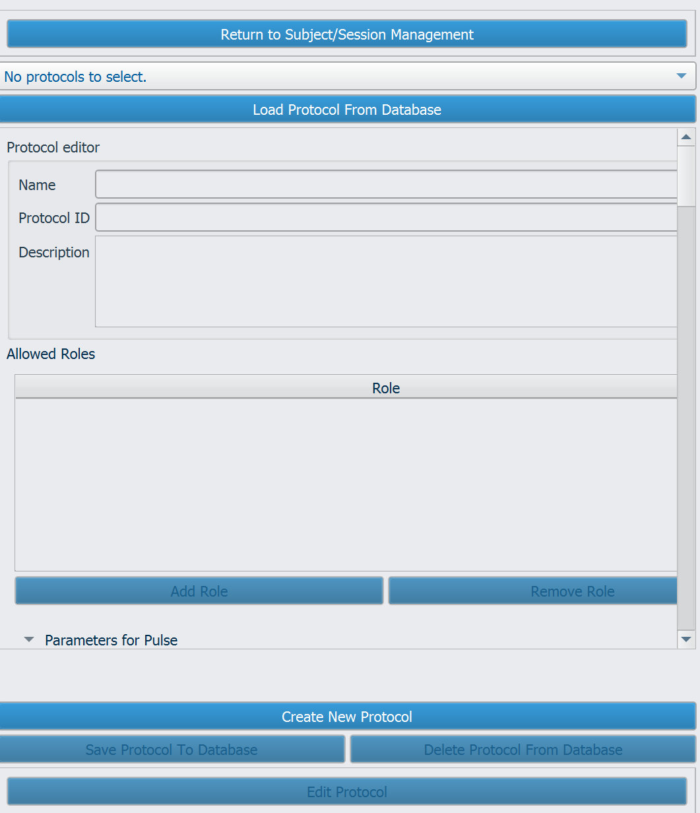
*Figure 1 — Load or create a new protocol. A user's permissions may prevent them from creating and/or editing a protocol.*

### Create a new protocol

To create a new protocol, click **Create New Protocol**.

### Load a protocol

To load a protocol, click **Load Protocol from Database**, select a protocol, and click **OK**.

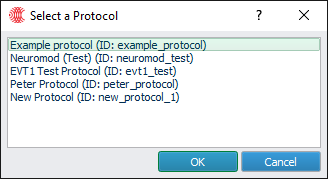
*Figure 2 — Saved protocols can be loaded from the database using the protocol selection window.*

Once the protocol is open, click **Edit Protocol** to make the attributes editable.

### Edit protocol info

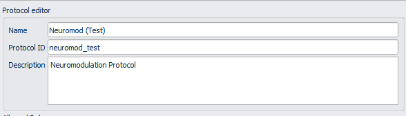
*Figure 3 — Editing the protocol allows users to assign it a name and unique ID.*

In the Protocol Info section, the following can be set:

| Protocol Info | Description |
| --- | --- |
| **Name** | Descriptive display name for the protocol |
| **Protocol ID** | Unique identifier of the protocol (typically lowercase and underscores) |
| **Description** | Protocol description |

## Protocol Roles

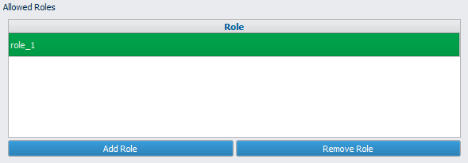
*Figure 4 — Admins can set user permissions which limit access to specific protocols.*

The Protocol Roles table restricts creation and loading of sessions with this
protocol to users who have one or more of the listed roles. Admin users can always
create or load from any protocol. An empty list of roles means the protocol can
only be loaded by admins.

!!! note "The `operator` role is not assigned by default"
    Add the `operator` role to allow users with the `operator` role to access this
    protocol.

### Add role

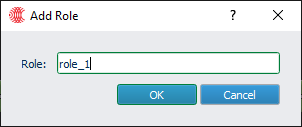
*Figure 5 — When creating a role, add a name for the role.*

To add a role, click **Add Role**, type the name of the role into the box, and click **OK**.

### Delete role

To delete a role, select it in the table and click **Remove Role**.

## Sonication protocol parameters

The software allows configuration of various system attributes within a
**Protocol**. A Protocol establishes the parameters for sonicating an intended
target — the targeted dose (amplitude and sequence timing) and the configuration
for calculating steering delays and beam-profile simulations. It also defines
constraints for target locations and derived assessments of the simulated beam
sequence.

!!! info "Protocol vs. Solution"
    Protocols remain independent of any specific Subject or MRI target location.
    The combination of target-specific time delays and voltages is defined as a
    **Solution**, which is then used to configure the Open-LIFU hardware.

### Pulse parameters

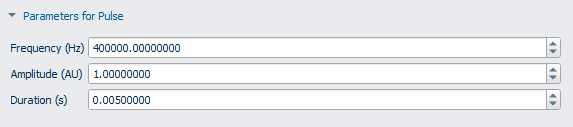
*Figure 6 — Example pulse parameters.*

The Pulse Parameters section contains information about the pulse shape:

| Pulse parameter | Description |
| --- | --- |
| **Frequency (Hz)** | Center frequency of the pulse. Should match the hardware. |
| **Amplitude (AU)** | Amplitude of the pulse (0–1). Can lower the duty cycle at which pulses are generated by the transmitter's transistors, making the output signal smaller. In general, leave at 1.00 and allow the beamformer to set amplitude via voltage settings. |
| **Duration (s)** | Duration of the pulse in seconds. Cannot be > 100 ms (0.1 s). |

### Sequence parameters

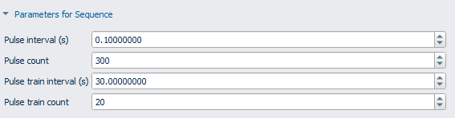
*Figure 7 — Sample sequence parameters.*

The Sequence Parameters section contains information about the sequence timing:

| Sequence parameter | Description |
| --- | --- |
| **Pulse Interval (s)** | Time between the onset of each pulse. |
| **Pulse Count** | Number of pulses within a single pulse train. |
| **Pulse Train Interval (s)** | Time between the start of each pulse train. A special case of 0 sets the interval to the pulse train duration (pulse interval × pulse count). |
| **Pulse Train Count** | Number of pulse trains within a sequence. |

A graphical representation of the sequence is displayed below:

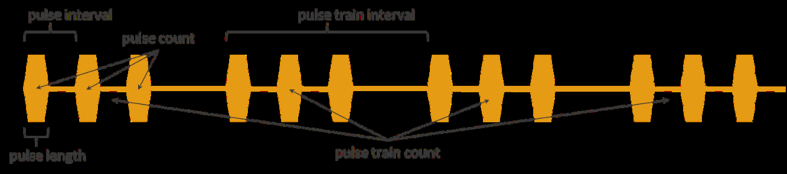
*Figure 8 — Sample pulse train.*

### Focal pattern

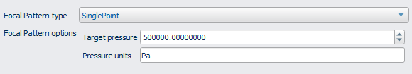
*Figure 9 — Sample target pressure value.*

The Focal Pattern section configures the spatial distribution of pressure at the
nominal target. The options available depend on the Focal Pattern type selected in
the dropdown.

!!! note "Firmware support"
    As of June 2026, only the **SinglePoint** type is supported by device firmware.

#### SinglePoint

A SinglePoint focal pattern is the default, using a single focus onto the target
location. It accepts:

| Focal pattern option | Description |
| --- | --- |
| **Target Pressure** | Targeted peak negative pressure at the focus |
| **Pressure units** | Units the pressure is provided in (Pa, MPa, kPa, etc.) |

#### Wheel (future implementation)

A Wheel focal pattern rasters the focus in the x–y plane around a circular pattern.
Because the foci are longer in the depth direction (z) than they are wide, this
allows a more spherical region to be sonicated. The total number of foci
(center + spokes) cannot exceed 16.

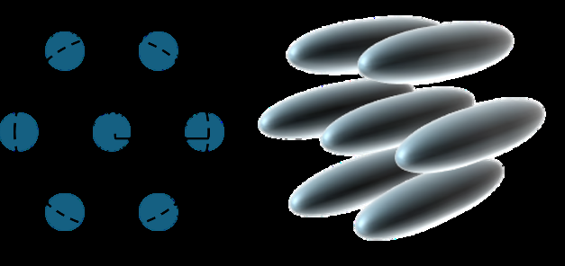
*Figure 10 — The Wheel focal pattern.*

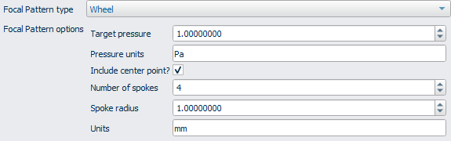
*Figure 11 — Focal Pattern Editor showing adjustable geometric and spacing parameters.*

| Focal pattern option | Description |
| --- | --- |
| **Target Pressure** | Targeted peak negative pressure at the focus |
| **Pressure units** | Units the pressure is provided in (Pa, MPa, kPa, etc.) |
| **Include Center Point** | Includes the center of the circle if selected |
| **Number of Spokes** | Number of points along the circle to use |
| **Spoke Radius** | Radius of the circle |
| **Units** | Spatial units of the spoke radius (default mm) |

### Simulation setup

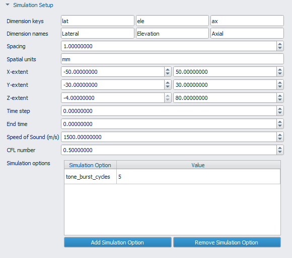
*Figure 12 — Sample values used to define the simulation setup.*

The Simulation Setup section provides parameters for configuring k-Wave
simulations. For most applications, users only need to verify and/or adjust the
X-, Y-, and Z-extents to ensure the expected depth and position of the treatment
target is within the simulation grid.

| Simulation setup | Description |
| --- | --- |
| **Dimension Keys** | IDs of the x, y, and z dimensions (leave as `lat`, `ele`, and `ax`) |
| **Dimension Names** | Display names for the dimensions |
| **Spacing** | Voxel spacing |
| **Spatial Units** | Units of the voxel spacing (mm or m) |
| **X-extent, Y-extent, Z-extent** | Upper and lower simulation bounds |
| **Time step** | Time step of the simulation (s). Leave at 0 for automatic calculation. |
| **End time** | Duration of the simulation (s). Leave at 0 for automatic calculation. |
| **Speed of Sound** | Nominal speed of sound for auto-calculating simulation duration |
| **CFL** | Courant–Friedrichs–Lewy number for numerical convergence. Set to 0.5 by default. |
| **Simulation Options** | Additional options that can be passed to the simulation code (dictionary) |

### Beamforming delay options

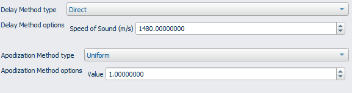
*Figure 13 — Sample beamforming delay options.*

This section configures time-delay calculation. **Delay Method Type** chooses the
type of beamforming used for calculating time delays; subsequent options depend on
the chosen method. If custom beamformers have been added to the code, they appear
here.

#### Direct

Direct beamforming uses distance and uniform time-of-flight calculations to
determine transmit delays.

| Delay method | Description |
| --- | --- |
| **Speed of Sound (m/s)** | The speed of sound used for beamforming in the absence of a volume |

### Beamforming apodization options

In Open-LIFU, *apodization* refers to which elements are active or not — partial
apodization of each element is not currently supported. The options are determined
by the Apodization Method type.

#### Uniform

Uniform apodization sets all apodization values the same.

- **Value:** Apodization scaling (0–1). Scales all element signals down if < 1.0. Leave at 1.0.

#### Max Angle

Maximum-angle apodization determines whether an element is active based on the
angle between its normal vector and the target.

- **Max Angle:** Maximum angle beyond which an element turns off.
- **Angle Units:** Units in which the maximum angle is specified (rad or deg; default deg).

### Segmentation options

Segmentation is the process by which voxels of the MRI image are converted into
material properties used for beamforming. For beamforming methods like Direct, the
voxel values are not used, so simple segmentations are acceptable.

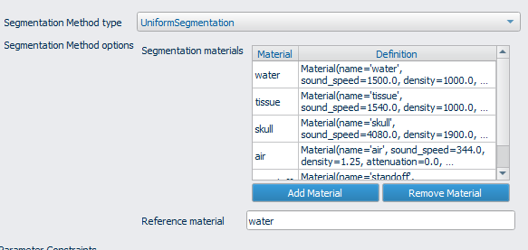
*Figure 14 — Use this window to select segmentation options.*

All segmentation methods include a dictionary of **Materials**, which specify a
speed of sound, density, attenuation coefficient, specific heat, and thermal
conductivity — all of which can be modified.

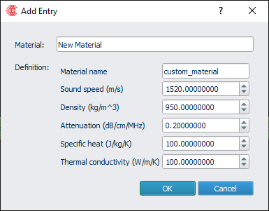
*Figure 15 — Create new material definitions by inputting values and giving the material a name.*

- **Uniform Water** — assigns all parameters to the `water` material.
- **Uniform Tissue** — assigns all parameters to the `tissue` material.
- **Uniform Segmentation (Custom)** — assigns all parameters to the material specified.

### Parameter constraints

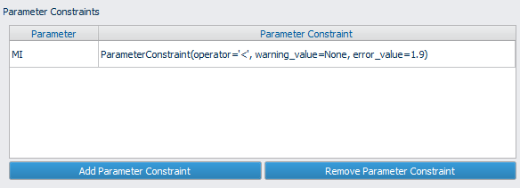
*Figure 16 — Procedure guardrails via parameter constraints.*

Parameter Constraints set requirements on the results of a Solution Analysis,
providing safety guardrails or warning the user if certain parameters are outside
the expected range. If a **warning** is flagged, the user is prompted to revise the
protocol or proceed to sonication. If an **error** is flagged, the user cannot
proceed to sonication with this solution.

Click **Add Parameter Constraint** to define a new constraint:

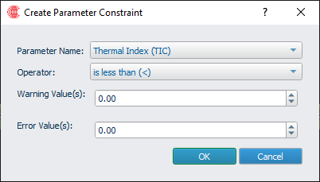
*Figure 17 — Creating a parameter constraint.*

- **Parameter Name:** Which parameter to constrain.
- **Operator:** The direction to apply the constraint. The constraint defines the condition for which the parameter is acceptable — e.g., a *Less than* operator means the parameter is OK if it is less than the Warning or Error value.
- **Warning Value:** The threshold for throwing a warning.
- **Error Value:** The threshold for throwing an error. An error takes precedence over a warning.

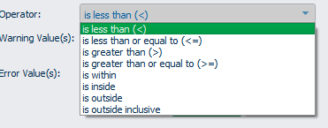
*Figure 18 — Select the appropriate operator using the dropdown menu.*

### Target constraints

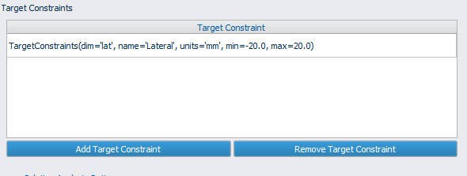
*Figure 19 — Users may also create target constraints.*

The Target Constraints section configures nominal limits on the placement of
targets relative to the transducer. This can exclude poor transducer positions
prior to any beamforming or simulation. To add one, click **Add Target
Constraint**; to remove one, select a row and click **Remove Target Constraint**.

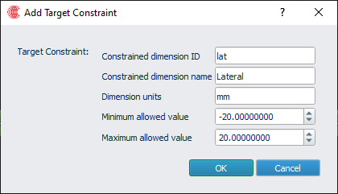
*Figure 20 — Adjusting target constraint values.*

| Target constraint | Description |
| --- | --- |
| **Constrained dimension ID** | Must match a dimension in the sim setup |
| **Constrained dimension Name** | Name from the sim setup |
| **Dimension units** | Units in which the constraint is specified |
| **Minimum Allowed Value** | Lower bound for that dimension |
| **Maximum Allowed Value** | Upper bound for that dimension |

### Solution analysis options

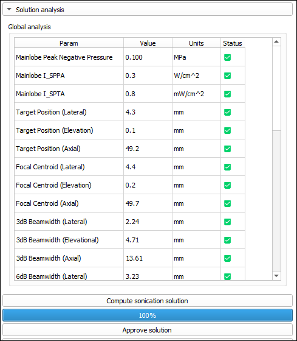
*Figure 21 — Sample solution analysis options.*

The Solution Analysis Options section dictates the post-processing and scoring of a
calculated Solution following beam simulation. These configurations establish the
acoustic reference environment, geometric masking for mainlobe/sidelobe
differentiation, and specific parameter constraints for identifying out-of-range
Solutions. The mainlobe is modeled as an ellipsoid focused at the target (sized by
aspect ratio and mask radius); the sidelobe region is everything outside an outer
ellipsoid, constrained by a minimum axial depth to filter out near-field artifacts.
Beamwidth evaluations run along the lateral and elevation axes relative to the
focus, extending to the defined search radius.

| Solution analysis option | Description |
| --- | --- |
| **Standoff sound speed (m/s)** | Acoustic velocity within the coupling medium, required for calculating initial impedance at the transducer interface |
| **Standoff density (kg/m³)** | Mass density of the standoff material used for initial impedance calculations |
| **Reference sound speed (m/s)** | Baseline speed of sound in the propagation medium used for deriving metrics |
| **Reference density (kg/m³)** | Baseline density of the propagation medium used for deriving metrics |
| **Mainlobe aspect ratio (lat, ele, ax)** | Proportional dimensions of the mainlobe mask; e.g. (1, 1, 5) indicates an axial length five times its width |
| **Mainlobe mask radius** | Radial size of the mainlobe ellipsoid, scaled by the aspect ratio and expressed in *Distance units* |
| **Beamwidth search radius** | Maximum lateral and elevation distance from the focal center used for beamwidth detection |
| **Sidelobe radius** | Defines the boundary of the outer ellipsoid; acoustic energy beyond this point is categorized as sidelobe |
| **Sidelobe minimum z** | Axial depth threshold that excludes near-field signal noise from sidelobe calculations |
| **Distance units** | Linear units (mm, cm, or m) for all spatial parameters in this section |
| **Parameter constraints** | A list of requirements used to evaluate the Solution, managed via the standard constraint interface |

### Virtual fit options

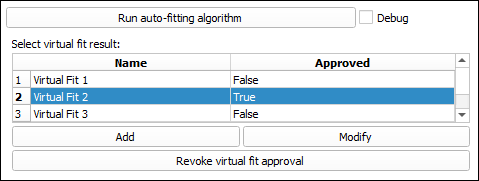
*Figure 22 — Sample virtual fit options.*

The Virtual Fit Options section defines the automated algorithm for identifying
optimal transducer positioning on the patient's anatomy for a specific target. The
process sweeps a grid of candidate orientations — defined by target-centric pitch
and yaw — and refines them by aligning the transducer face with a localized grid of
skin-surface points. Target reach is validated against steering constraints, and
the system generates a list of top-tier placement options for operator selection.

Pitch and yaw coordinates are centered on the target within the patient's ASL
(anterior-superior-left) coordinate system:

- **Pitch:** the angle between the anterior axis and the ray pointing to the candidate's projection on the anterior-superior plane.
- **Yaw:** the angle between the anterior-superior plane and the direct ray to the candidate location.

| Virtual fit option | Description |
| --- | --- |
| **Length units** | Units (mm, cm, or m) applied to all distance-based fields in this configuration |
| **Steering center distance** | The "optimum" axial distance from the transducer to the center of the steering volume. Candidate poses are ranked by how close to (0, 0, steering center distance) the target is. |
| **Steering limits** | Per-axis spatial boundaries (min/max pairs) defining the transducer's reachable steering area. Order is X (lateral), Y (elevation), Z (axial), relative to (0, 0, steering center distance). |
| **Pitch range** | Angular span (degrees) used for the pitch sweep during the fitting search |
| **Pitch step size** | Angular increment for the pitch sweep; finer steps increase precision but extend processing time |
| **Yaw range** | Angular span (degrees) used for the yaw sweep during the fitting search |
| **Yaw step size** | Angular increment between yaw values in the fitting search grid |
| **Plane fit yaw extent** | Half-width of the localized skin-sampling grid along the yaw axis for surface fitting |
| **Plane fit yaw step** | Angular distance between consecutive sample points along the yaw axis for plane fitting |
| **Plane fit pitch extent** | Half-width of the localized skin-sampling grid along the pitch axis for surface fitting |
| **Plane fit pitch step** | Angular distance between consecutive sample points along the pitch axis for plane fitting |
| **No. of candidates returned** | Limit on the number of high-scoring placement recommendations presented to the operator |

## Save a protocol

After completing configuration of a protocol for editing, click **Save Protocol to
Database** to save changes.

## Delete a protocol

To delete a protocol, while editing, click **Delete Protocol from Database**.

---

*This page reflects ER-00017 Revision A, software v1.20.0, released 2026-06-23.
For the full controlled-document archive, see the
[release PDF](ER-00017-RevA-Creating-Editing-Sonication-Protocols.pdf).*
