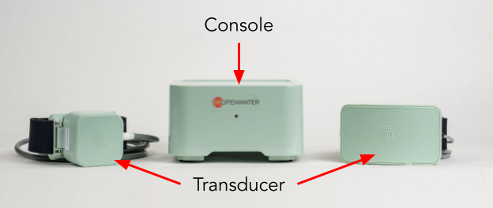
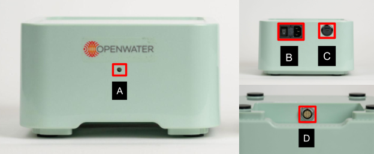
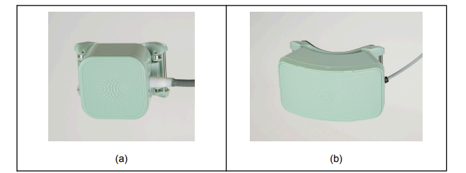
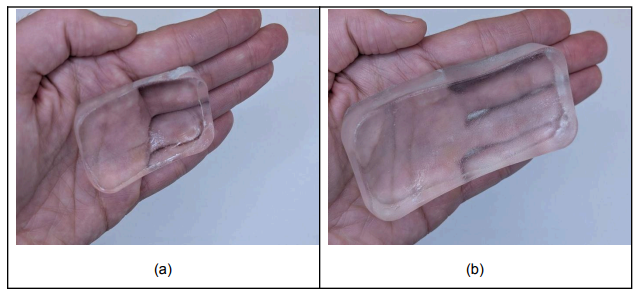

# The Open-LIFU System

The Open-LIFU hardware platform consists of three primary components.

| Component | Description |
|---|---|
| **Console** | Main control unit containing high-voltage power supplies, timing controllers, and communication interfaces. Generates and coordinates the electrical signals that drive the ultrasound transducer. |
| **Transducer** | Wearable headset-style housing containing one or more **Transmit Modules** (each a 64-element 2D matrix array), a deformable acoustic coupling pad, and unique geometric features for spatial tracking. |
| **Supporting hardware** | Android mobile device (photogrammetric reconstruction), USB-C cable to PC, optional water-tank testing accessories. |

!!! danger "Investigational device — do not modify without recharacterization"
    All Open-LIFU transducers and transmit modules are factory calibrated.
    **Reconfiguring or modifying any transducer immediately voids the factory
    calibration**, requiring users to recharacterize the transducer to
    ensure it complies with all necessary application-specific requirements.

    **The transducer is not watertight. Never submerge it in water.** Doing
    so may lead to electric shock or damage.

## Open-LIFU device specifications

### Console

| | |
|---|---|
| **Operating voltage**[^1] | 100–240 VAC, 50–60 Hz, 1.2 A (120 W) — or 3.5 A (180 W) |
| **High-voltage output**[^1] | ±10–60 V (120 W) — or ±10–65 V (180 W) |
| **Connections** | 1× USB-C (USB 3.0) 1× 12-pin socket (transducer) |
| **Device status** | LED indicator |
| **Dimensions (W × H × D)** | 9.8 × 3.0 × 6.3 in (250 × 75 × 160 mm) |
| **Weight** | 3 lb (1.36 kg) |

[^1]: Serial numbers `001`–`012` use the 120 W power supply (±60 V). Serial
    numbers `013` and beyond use the 180 W power supply (±65 V). To
    determine which is installed, refer to the serial number on the bottom
    of the console.

**Console status LED:**

| Color | Pattern | Meaning |
|---|---|---|
| None | Off | System is off |
| Green | Solid | System is on and ready |
| Blue | Solid | System is on and sonicating |
| Blue | Pulsing | Error |

### Transmit Module

Each transmit module is a self-contained beamforming unit. The transducer
housing contains one (1×) or two (2×) modules connected via ribbon cable.

| | |
|---|---|
| **Operating voltage** | 12 VDC, 1.2 A |
| **High-voltage input** | ±0–100 V |
| **Beamformer clock** | 10 MHz |
| **Array center frequency** | 155 kHz or 400 kHz |
| **Number of elements** | 64 (per module) |
| **Array dimensions** | 40 × 40 mm |
| **Element size (W × L)** | 4.7 × 4.7 mm |
| **Element pitch** | 5 mm |
| **Overall dimensions (W × L × D)** | 2.0 × 2.6 × 1.2 in (52 × 67 × 30 mm) |
| **Connections** | 1× 12-pin socket (input) 1× 30-pin socket (input) 1× 30-pin socket (output) |
| **Device status** | LED indicator |
| **Weight** | 0.4 lb (187 g) at 155 kHz · 0.3 lb (132 g) at 400 kHz |

### Transducer configurations

Open-LIFU transducers ship as wearable headsets with a soft strap, a
disposable coupling pad, and padding to prevent slipping. The outer
faceplate has an embossed pattern used for spatial localization. The
faceplate can be removed to access the transmit modules for service but
**should not be removed during normal use**.

Two standard configurations are offered:

- **1× (single transmit module)** — for shallower targets
- **2× (dual transmit module)** — for deeper targets

Both are available at 155 kHz or 400 kHz. Custom configurations (more
modules, alternative arrangements) are supported within the architecture
but are beyond the scope of this document and require recharacterization.

#### Transmit module acoustic output

Representative values — exact values vary per serialized transducer.

| | 1× 155 kHz | 1× 400 kHz | 2× 400 kHz |
|---|---|---|---|
| **Peak P-** @ 60 V and (0, 0, 50) mm | 0.7 MPa | 1.1 MPa | 2.16 MPa |
| **Derated P- (Pr.3)** @ 60 V | 0.68 MPa | 1.02 MPa | 2.01 MPa |
| **Voltage** | ±10–60 Vmax | ±10–60 Vmax | ±10–60 Vmax |
| **Mechanical Index (MI)** in water[^2] @ 60 V and (0, 0, 50) mm | 1.7 | 1.8 | 3.18 |
| **Axial FWHM** @ (0, 0, 50) mm | 34 mm | 31 mm | 15 mm |
| **Transverse FWHM** @ (0, 0, 50) mm | 8 mm | 4.5 mm | 4.7 mm (elev.) / 2.4 mm (azim.) |
| **Axial steering range** | 4–6 cm | 4–7 cm | 3–11 cm |
| **Transverse steering range** | ±1 cm | ±1.5 cm | ±2 cm |
| **Pressure–voltage sensitivity** @ (0, 0, 50) mm focus | 6 kPa/Vpp @ 30 mm | 9.9 kPa/Vpp @ 45 mm | 18 kPa/Vpp @ 50 mm |

[^2]: Limited to 1.9 by the Open-LIFU software.

### Sonication sequence specifications

Programmable sonication parameters and their typical / minimum / maximum
values:

| Category | Parameter | Description | Typical | Min | Max |
|---|---|---|---|---|---|
| **Pulse** | Frequency (kHz) | Pulse center frequency | 155 or 400 | — | — |
| Pulse | Focal Pressure (kPa) | Peak negative pressure at target | 500 | 0 | 1200 |
| Pulse | Duration (ms) | Pulse duration | 5 | 0.01 | 100 |
| **Sequence** | PRI (ms) | Pulse repetition interval | 100 | 10 | 1000 |
| Sequence | Pulse count | Number of pulses per train | 300 | 1 | 1000 |
| Sequence | PTRI (s) | Pulse train repetition interval | 30 | 0 | 120 |
| Sequence | Train count | Number of pulse trains | 20 | 1 | Protocol-dependent |

## System architecture

A mobile device is used to help localize the transducer by capturing a
series of images, which are then reconstructed into a 3D mesh using local
computer processing or cloud compute. The PC runs the Open-LIFU Desktop
Application (or the Slicer extension) to plan, configure, and run
sonications. The application communicates with the console to configure the
high-voltage supply and transducer to execute a Solution. The transducer is
placed on the subject using coupling gel and a disposable coupling pad.

<figure markdown="span">
  { width="800" }
  <figcaption>Figure 1 — Open-LIFU system architecture for a 1× and 2× transducer configuration (ER-00015 Rev A, p. 13).</figcaption>
</figure>

## System hardware

<figure markdown="span">
  { width="700" }
  <figcaption>Figure 2 — Open-LIFU 1× (left) and 2× (right) configurations shown alongside the Console.</figcaption>
</figure>

### Console

The console connects to a PC via a USB-C cable and generates the positive
and negative supply voltages used to drive the transducer.

<figure markdown="span">
  { width="700" }
  <figcaption>Figure 3 — Parts of the Console (ER-00015 Rev A, p. 15). (A) Status LED on front, (B) Power switch and receptacle, (C) USB port to PC, (D) Transducer cable port.</figcaption>
</figure>

### Transducer

The transducer uses a factory-configurable headset-style housing containing
one or two transmit modules — 1× or 2× configuration, at either 155 kHz or
400 kHz.

<figure markdown="span">
  { width="600" }
  <figcaption>Figure 4 — The Open-LIFU transducer in headset-style housing (ER-00015 Rev A, p. 16). The faceplate's embossed pattern aids transducer localization.</figcaption>
</figure>

!!! note "Transducer orientation"
    The transducer has an up–down orientation. Mechanical features prevent
    upside-down assembly, and a debossed arrow on the side of the body
    indicates the "up" direction. The cable exits toward the subject's left
    ear when the transducer is worn on the forehead.

A soft padded foam frame on the transducer provides a comfortable, non-slip
interface for placement on a subject. The transducer also has a removable
curved "veneer" attached to it, used for transducer localization. **Do not
remove or damage the veneer.**

### Coupling Pad

The coupling pad sits inside the transducer to ensure good acoustic coupling
between the transducer and the subject.

<figure markdown="span">
  { width="500" }
  <figcaption>Figure 5 — Hydrogel coupling pad (ER-00015 Rev A, p. 17). Both 1× and 2× pads are available, shaped to match the corresponding transducer faceplate.</figcaption>
</figure>

Coupling pads are non-sterile and composed of a water-based polymer
hydrogel shaped to fit the faceted transducer faces and conform to curved
surfaces (e.g., the forehead). The coupling pad is needed to:

- Eliminate air interfaces between ultrasound probes and skin
- Reduce acoustic impedance mismatch
- Improve transmission of ultrasound energy

| | |
|---|---|
| **Density** | 1.12 (10³ kg/m³) |
| **Speed of sound at 35 °C** | 1520–1620 m/s |
| **Hardness** | 00 < 40 |
| **Peeling strength** | 220 g |

!!! note "Coupling pad packaging"
    When using coupling pads, open packaging carefully at marked areas to
    avoid tearing or damaging the pad.

## Additional hardware requirements

### PC

A PC is required to download and run the Open-LIFU application. Recommended
specifications:

- **Graphics card:** NVIDIA CUDA 11+
- **Operating system:** Windows 11+
- **Network:** recommended (optional for installation, optional for cloud services)
- **Storage:** at least 5 GB of free disk space

### Android phone

A mobile device is required for transducer localization through
photogrammetric reconstruction. Official support is provided for **Google
Pixel** phones — tested on the Pixel 5, 7, 9, and 10. Other phones meeting
the minimum specifications (e.g., Samsung Galaxy A16, Motorola moto g)
should also work, but full compatibility cannot be guaranteed. For help
with non-supported phones, visit the
[Discord](https://discord.gg/fS7vfAX4fA).

**Minimum phone specifications:**

- Android 14 or newer
- Dual camera: 12.2 MP, f/1.7, 27 mm wide, 1/2.55", 1.4 µm, dual-pixel PDAF, OIS · 16 MP, f/2.2, 117° ultrawide, 1.0 µm
- Accelerometer, gyroscope

---

*Next: [Software Development](software.md) for the five-layer software stack,
the SDK, and transmit-module wiring diagrams.*
