# Water Tank Testing

> **Document ID:** ER-00016 · **Revision:** A · **Change Order:** ECO-000249 · **Effective:** 2026-05-26 · **Approvers:** David Paribello, Peter Hollender, George Vigelette, Mark Watson, Ray Chiu, Madhumita Srikanth · **Authors:** Muhammad Zubair, David Paribello, Mykhaylo Danikhno

This page outlines water tank (Onda AIMS III Water Tank and Soniq 5.3+ software)
testing procedures for **acoustic verification of Open-LIFU transducers** using the
Open-LIFU Test Application. It is designed for straightforward hardware validation
and basic operational testing through an intuitive, QML-based interface to control
the Open-LIFU system.

Unlike the advanced Verification Tank suite — which focuses on automated field
mapping and complex acoustic characterization — the Test App is streamlined for
end-users. It lets you quickly verify basic hardware functionality, run test
procedures on transducers, and load preset solutions without extensive Python
programming or direct interaction with the underlying SDK.

!!! danger "Never fully submerge the transducer"
    The transducer is **cleanable but not waterproof**. **DO NOT fully submerge the
    transducer in the water tank.** Doing so will damage the device and may result in
    injury. Only the housing is partially submerged, with the sealed seam below the
    water surface and the top of the wall extender above the water line.

!!! note "Tank setups vary"
    Water tank setups differ, so instructions may change depending on the tank being
    used. Users with a different water tank and software package may use this document
    as a guide while adapting the workflow to their specific setup and application.

## Choosing a tool

To test the Open-LIFU device with a water tank, you may use any of the following:

| Tool | Notes |
| ---- | ----- |
| **Open-LIFU Test App** *(recommended)* | QML-based Python UI. Load solution(s) and run. |
| **Open-LIFU Python** | Object-oriented interfaces for each system component. |
| **Slicer Open-LIFU** *(advanced)* | Plan and generate preconfigured sonication solutions, then export and load into the Test App. |
| **Open-LIFU Desktop** | Graphical interface to plan and generate sonication solutions. |

!!! note
    This page focuses specifically on the **Open-LIFU Test App**. To use another
    application, review the documentation in its respective repository:
    [Software Development](https://docs.openwater.health/openlifu/software/) ·
    [Slicer Open-LIFU](https://docs.openwater.health/openlifu/slicer/).

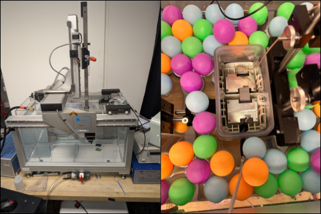
*Figure 1 — Onda AIMS III water tank setup (left) and the 2× transducer configuration partially submerged, top-down, in the tank (right).*

## Device compatibility

The Open-LIFU Test App **v1.0.15** is compatible with Open-LIFU hardware running:

| Component | Firmware |
| --------- | -------- |
| Transmitter | v2.0.x |
| Console | v1.2.x |

## Key features

- **Multi-instrument coordination** — integrated transducer control, data acquisition, and power management.
- **Automated measurements** — built-in scanning, peak finding, and field mapping.
- **Calibrated pressure measurements** — support for calibrated hydrophones with frequency-dependent sensitivity.
- **High-speed data acquisition** — PicoScope oscilloscope integration for precision timing.
- **Flexible control** — programmable power-supply control with voltage settling detection.

## System components

### Hardware

- **Water tank**
    - **Onda AIMS III Water Tank** — provides a controlled, repeatable acoustic environment for characterizing focused-ultrasound transducers.
    - **Calibrated hydrophone** — precision pressure sensor with tank positioning system. Testing uses the **HNR-500** with extended-frequency-range calibration.
    - **PicoScope 5000A Series** — high-speed USB oscilloscope for data acquisition.
- **Open-LIFU transducer system**
    - Multi-element focused-ultrasound transducer with beam steering.
    - Trigger sync cable (ribbon to BNC).
    - Transducer fixture (holder).

### Software

- **Onda Soniq 5.3+** — industry-standard suite for acquiring, mapping, and analyzing acoustic fields in liquids, typically used with the AIMS III hydrophone scanning system.
- **Open-LIFU software** (one of the following):
    - **Test App** *(recommended)* — QML-based Python UI; load solution(s) to run.
    - **Python API** — object-oriented interfaces for each system component.
    - **Slicer Open-LIFU extension** *(advanced)* and **Open-LIFU Desktop** — plan and generate preconfigured sonication solutions, then export and load into the Test App.

## Why water tank testing

Water tank testing provides a controlled, repeatable acoustic environment for
characterizing Open-LIFU transducer performance. These tests verify that
transducers function properly and operate within designed performance
specifications.

The transducer is designed to be cleanable but is **not waterproof**. The cable
entry and transmit modules have a watertight silicone seal with the housing, but
the patterned top lid does **not** form a watertight seal with the rest of the
housing. To support water tank testing, the system must be temporarily modified to
allow partial submersion.

To scan beam plots, mount the transducer **face down** (partially submerged,
top-down approach) and attach the hydrophone to the translation stage.

## Required accessories

!!! note "Accessories kit"
    The Water Tank Accessories Kit (**PN 900-00016**) can be purchased by contacting
    your local sales representative. Alternatively, build your own from Openwater's
    [openlifu-mechanical](https://github.com/OpenwaterHealth/openlifu-mechanical) repository.

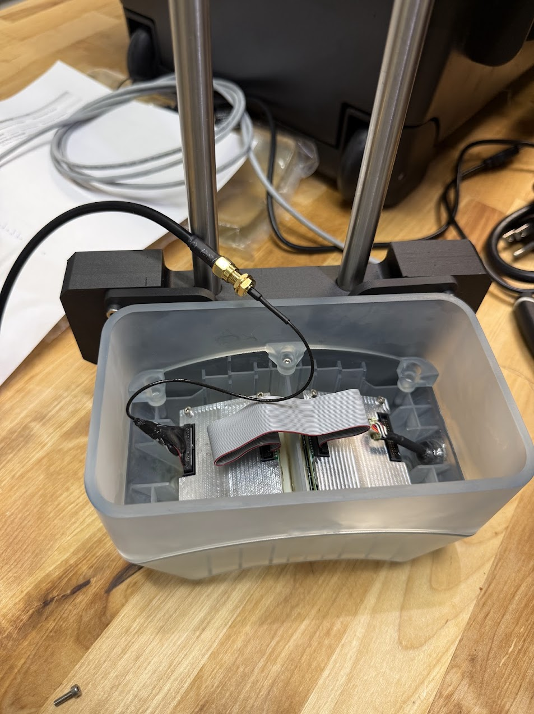
*Figure 2 — The fully assembled transducer with water tank extender prior to placing it in the water tank.*

### Wall extender

A wall extender replaces the pressing lid and veneer, allowing more of the
transducer to be submerged without risking water spilling into the electronics. It
is sealed with a silicone rubber gasket.

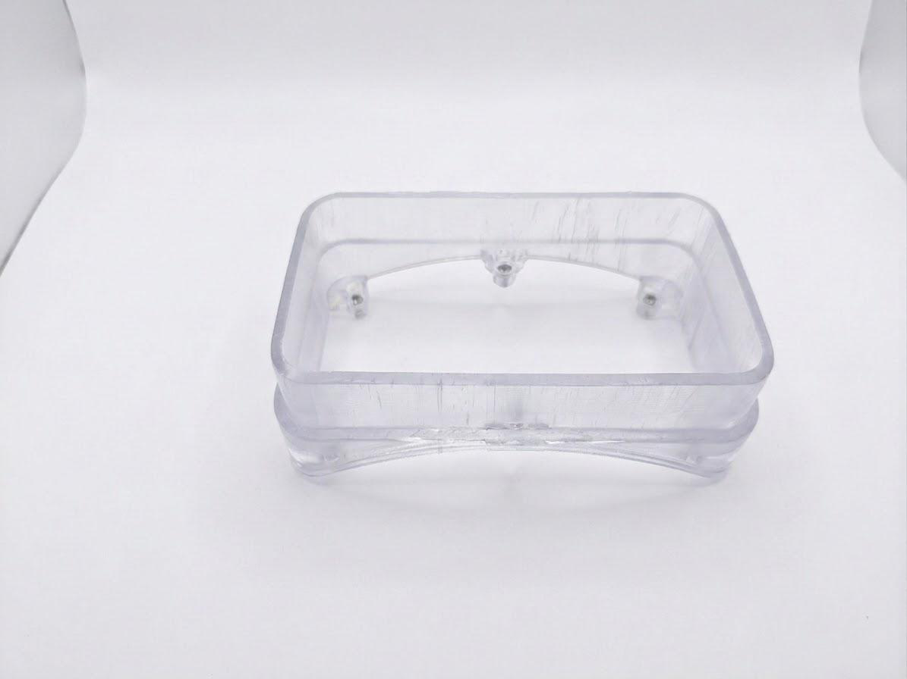

### Water tank holder

A dedicated fixture with a two-rod mount interface supports mounting the 2X
enclosure with pre-attached (glued) transducers. To install, remove two screws from
the toggles, position the enclosure within the fixture, align the toggle holes and
cable notch, then secure the enclosure to the fixture with the screws. This fixture
positions the transducer normal to the scanning tank axes.

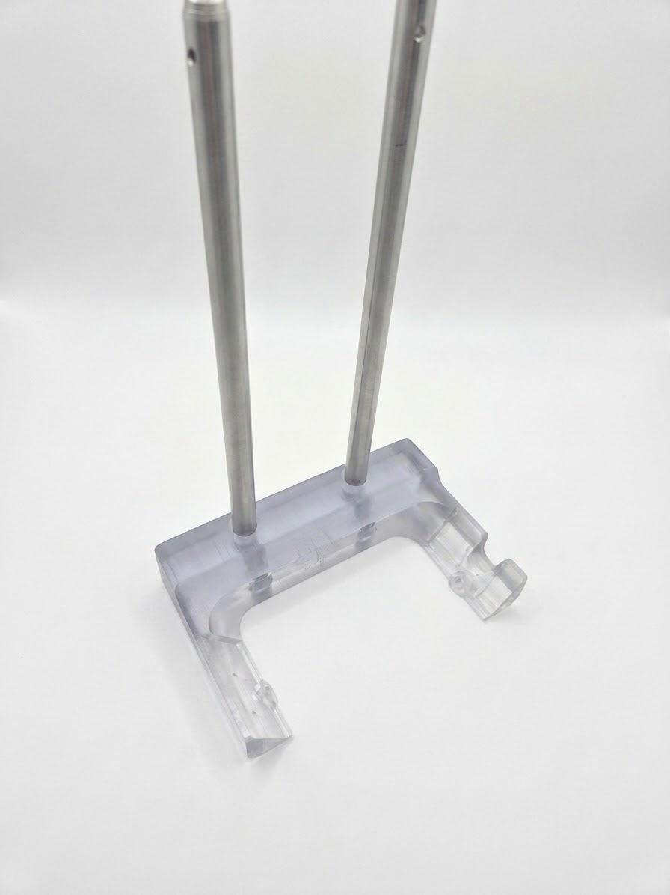

### Trigger cable adapter

To synchronize ultrasound emission with an oscilloscope recording a hydrophone
signal, a cable hooks into the output ribbon connector of the final transmit module
and routes the trigger sync signal to an SMA connector.

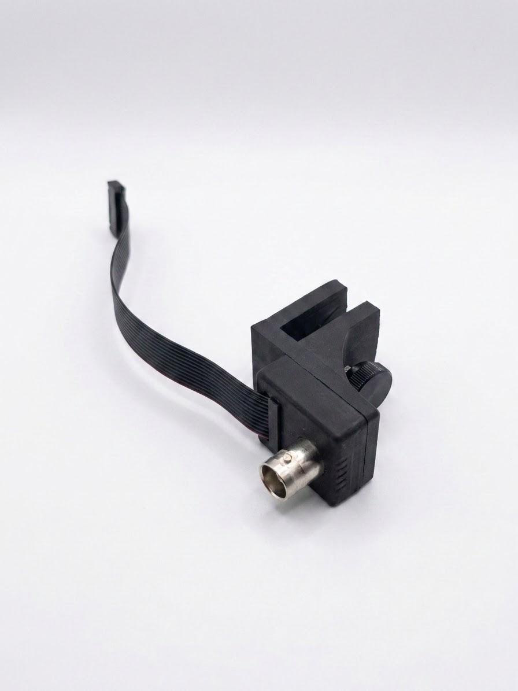
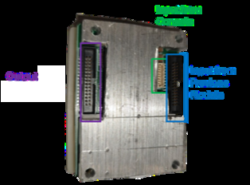

## Attaching the extender

The extender raises the height of the transducer housing for partial submersion.

1. Remove the patterned lid (veneer) by lifting the tab on the left side.

    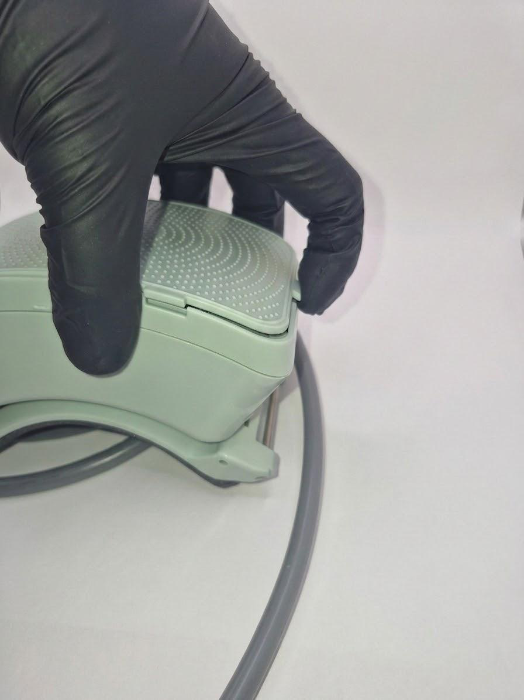

2. Using a 2.5 mm hex screwdriver, loosen the 6 M3 screws holding the under-lid (pressing lid) in place and remove them.
3. Remove the under-lid (pressing lid), exposing the trigger cable.
4. Remove the O-ring gasket from the groove of the bottom enclosure.
5. Using a 2.5 mm hex screwdriver, remove the two M3 screws holding the enclosure bottom at the frame toggles.
6. If the extender gasket has a protective layer, remove it. Place the extender gasket on the bottom enclosure.

    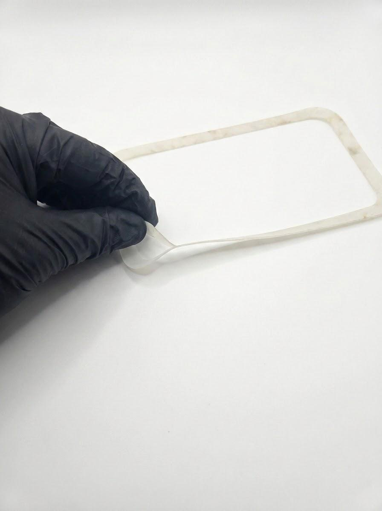

7. Place the wall extender on top of the gasket.
8. Using the 2.5 mm hex screwdriver, insert the 6 M3 × 8 mm screws into the holes inside the extender.
9. Tighten the screws to secure the extender and compress the gasket. Begin by partially tightening each screw without fully securing them, ensuring the gasket stays properly seated and uniformly aligned against the entire surface.
10. Tighten the screws gradually in a diagonal pattern, applying even pressure in multiple stages for consistent compression.
11. Be careful not to over-tighten and damage the threaded inserts.

    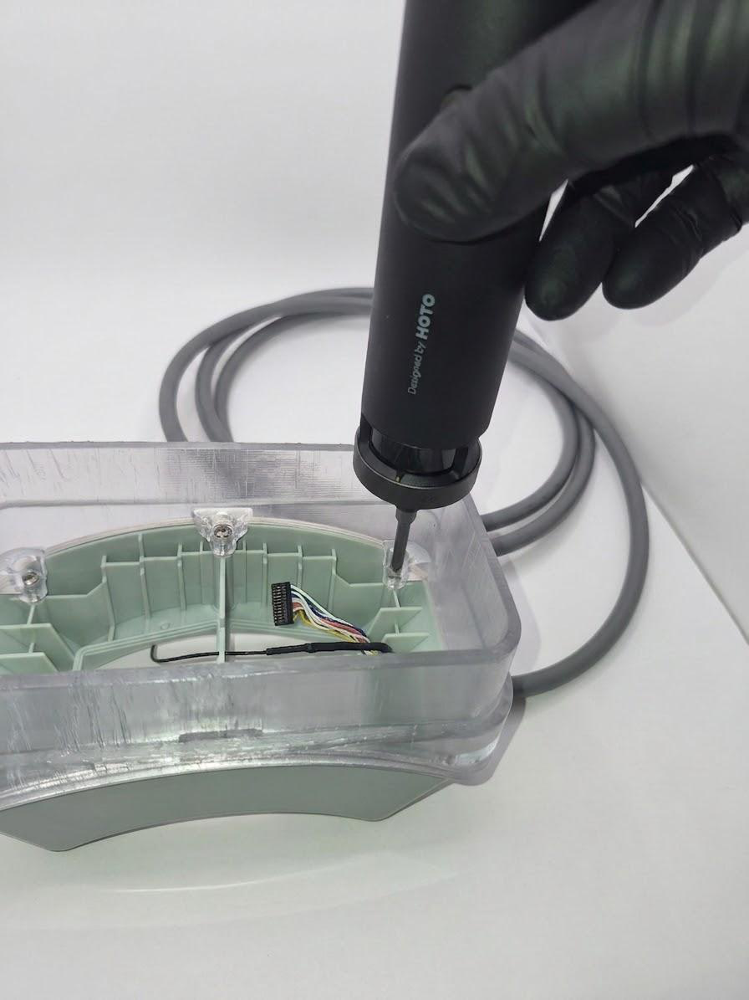

12. To work with a single transducer, carefully remove the daisy-chain cable from the ribbon cable connector.
13. Connect the trigger cable of the ribbon-to-BNC adapter into the ribbon connector opposite the entry cable.

    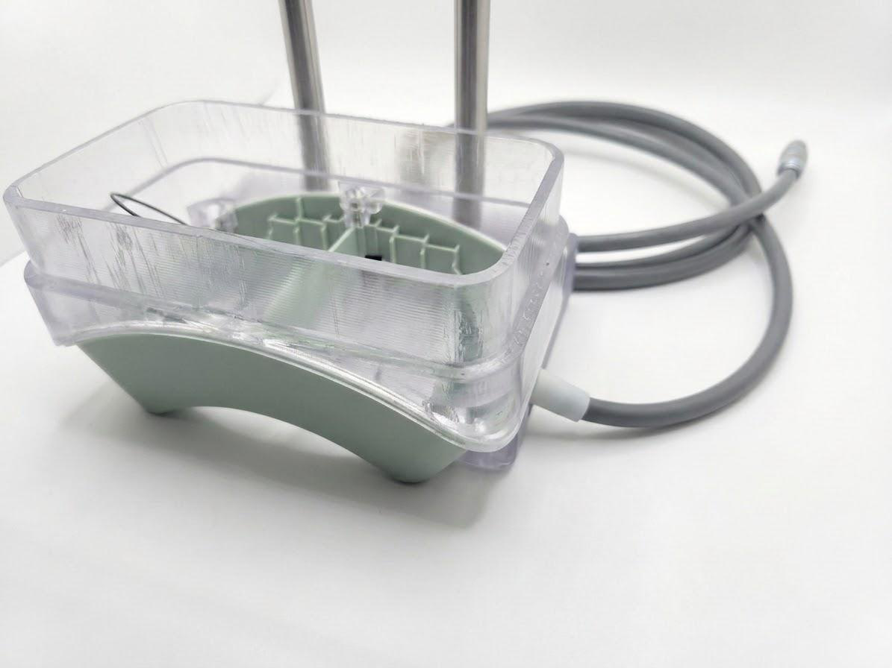

14. Place the enclosure onto the mount, aligning the toggle mounting holes.
15. Using the 2.5 mm hex screwdriver, fix the enclosure to the mount with two M3 × 8 mm screws.
16. Partially submerge the housing in water so the sealed seam is below the water surface.

    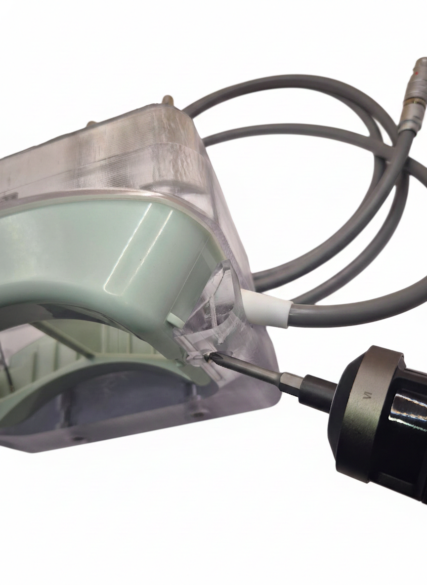

!!! warning "Leak check before powering on"
    After step 16, **wait 4–6 hours and confirm the seal is not leaking before
    powering on the system.**

## Water tank holder fixture

!!! note
    The water tank holder fixture uses **dual 12 mm rod interfaces** for mounting the
    2× transducer enclosure.

Openwater provides a water tank mount fixture compatible with the Onda AIMS III tank
for repeatable positioning against a corner of the large tank. The mount has two
12 mm rod interfaces as a standard.

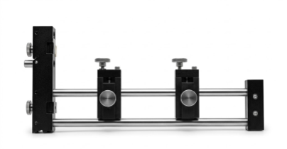

1. Position the fixture against a corner of the large tank.
2. Adjust the height of the holder to sink the transducers **at least 10 mm** into the water, keeping the top of the wall extender edge **above** the water level.
3. Remove all bubbles under the transducers with a soft brush and/or syringe.
4. Set up the hydrophone close to the best focus position.

## Removing the extender

1. Using a 2.5 mm hex screwdriver, remove the 2 M3 screws holding the enclosure at the mount.
2. Using a 2.5 mm hex screwdriver, remove the 6 M3 screws holding the wall extender at the enclosure.
3. Carefully remove the separate trigger cable.
4. Carefully place the daisy-chain cable into the ribbon cable connector.
5. Remove the extender gasket.
6. Place the O-ring gasket into the groove at the enclosure bottom; make sure it is not twisted.
7. Seat the pressing lid in the groove on the gasket.
8. Using the 2.5 mm hex screwdriver, insert the 6 M3 screws.
9. Tighten the pressing lid in place, being careful not to over-tighten the bolts.
10. Place the veneer and press down to secure it.
11. Using a 2.5 mm hex screwdriver, install 2 M3 screws to fix the enclosure bottom at the frame toggles.

## Open-LIFU Test App download

1. Navigate to the [openlifu-test-app](https://github.com/OpenwaterHealth/openlifu-test-app) repository.
2. Open the [latest release](https://github.com/OpenwaterHealth/openlifu-test-app/releases/latest) and download the ZIP file.
3. Extract the files to a location on the local computer.

## Running the Test App

If you are only measuring pressure output to confirm the Open-LIFU system is working
as intended, the **openlifu-test-app** is recommended.

1. Navigate to where the files were extracted and double-click the executable.
    - Acknowledge the Microsoft Defender SmartScreen warning and select **Run anyway**.
2. Refer to the [Controller Page Guide](https://github.com/OpenwaterHealth/openlifu-test-app/blob/main/docs/controller-page-user-guide.md) to configure and run an arbitrary sonication.

## Best practices

!!! warning
    Failure to follow proper safe-handling and operating procedures of the transducer
    may result in injury or damage to the equipment being tested.

- Use **degassed water**.
- Leave high voltage on between scans if running multiple scans, to avoid ramp up/down time.
- Use a **shorter pulse** when measuring pressure / spatial scans.
- When doing spatial beam scanning, adjusting some parameters from their therapeutic values can aid fast, reliable scans and prolong hydrophone life:
    - Use a shorter pulse duration to capture steady-state amplitude (e.g., 200 µs).
    - Use a shorter pulse interval for faster signal capture (e.g., 20 ms).
    - Use a lower pulse amplitude to reduce cavitation of air bubbles in the tank (e.g., 40 Vpp).
    - After spatial mapping, make appropriate measurements with the full therapeutic dose.

## Where to ask questions

- **Discord** — fastest response: [discord.gg/fS7vfAX4fA](https://discord.gg/fS7vfAX4fA)
- **GitHub Issues** in the relevant repo (see the repository map in [Software Development](https://docs.openwater.health/openlifu/software/#repository-map))
- **Email** — <support@openwater.cc>

---

*This page reflects ER-00016 Revision A (ECO-000249), effective 2026-05-26, Test App
v1.0.15. For the full controlled-document archive, see the
[release PDF](ER-00016-RevA-Open-LIFU-Water-Tank-Testing.pdf).*
