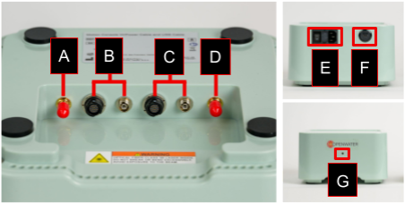
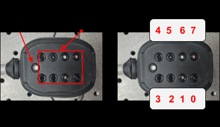

# The Open-Motion System

The Open-Motion hardware platform consists of three primary components.

| Component            | Description                                                  |
| -------------------- | ------------------------------------------------------------ |
| **Console**          | Houses the laser, electronics and optics, power cable, and an on/off switch on the back. Should **never be opened** — risk of laser radiation exposure and electrical hazards. |
| **Sensor Module(s)** | Wearable modules containing an array of camera sensors (configurable via software) and on-module histogram processing. |
| **Laser**            | Class 1, 795 nm, pulsed, integrated inside the Console.      |

!!! danger "Do not disassemble the Console"
    The Console contains a Class 3 laser source and high-voltage electronics.
    Opening the enclosure risks permanent eye injury and electric shock and
    voids all warranties.

## Open-Motion specifications

### Console

|                            |                                                              |
| -------------------------- | ------------------------------------------------------------ |
| **Operating voltage**      | 100–240 VAC, 50–60 Hz, 0.5 A                                 |
| **Connections**            | 1× USB-C (USB 3.0) 1× SMA trigger (input) 1× SMA sync (output) 2× electrical ports (left / right) 2× optical ports (left / right) |
| **Device status**          | LED indicator                                                |
| **Dimensions (W × H × D)** | 9.8 × 3.0 × 6.3 in (250 × 75 × 160 mm)                       |
| **Weight**                 | 3 lb (1.36 kg)                                               |

<figure markdown="span">
  { width="700" }
  <figcaption>Figure 1 — Parts of the Console (ER-00014 Rev A, p. 8). A SMA trigger output, B/C left and right Sensor Module ports, D SMA trigger input, E power switch, F USB-C, G status LED.</figcaption>
</figure>

### Sensor Module

Each Open-Motion device uses two Sensor Modules.

|                            |                                            |
| -------------------------- | ------------------------------------------ |
| **Image sensors**          | 1/3.52" CMOS                               |
| **Resolution**             | 1920 × 1280                                |
| **Frame rate**             | 40 Hz                                      |
| **Pixel size**             | 2.2 μm × 2.2 μm                            |
| **Dimensions (W × H × D)** | 2.1 × 1.6 × 2.5 in (52.5 × 39.4 × 64.1 mm) |
| **Cable length**           | 6 ft (2 m)                                 |
| **Weight**                 | 0.5 lb (0.2 kg)                            |

<figure markdown="span">
  { width="500" }
  <figcaption>Figure 2 — Sensor Module camera ordering (ER-00014 Rev A, p. 9). Cameras are indexed 0–7 in software and arranged in two rows of four on the connector.</figcaption>
</figure>

### Laser

|                                              |             |
| -------------------------------------------- | ----------- |
| **Laser classification**                     | Class 1     |
| **Wavelength**                               | 795 nm      |
| **Pulse duration**                           | 250–1000 μs |
| **Pulse repetition rate**                    | 40 Hz       |
| **Average power**                            | 12 mW       |
| **Energy per pulse** (at delivery fiber tip) | 300–500 μJ  |

## System architecture

The general system architecture connects the host PC to the Console over USB,
and the Console to one or two Sensor Modules over paired electrical and optical
links.

!!! note "USB cable requirement"
    The USB cable must be a USB-A to USB-C cable and **can only be sourced from
    Openwater** (part number `100-00049`). Substituting a generic cable can
    cause data integrity issues at full link speed.

<figure markdown="span">
  ![Open-Motion system architecture: a Host Computer with system control, data processing, GUI, and data storage connects via USB HS to the Console; the Console contains the Console Board (system timing, laser drivers, safety circuits, AC/DC power converter) and Optical Components (laser butterfly package, 50:50 fiber splitter); the Console connects to two Wearable Sensor Modules via a multi-purpose cable carrying data, power, and light; each Sensor Module contains an Aggregator Board, eight camera sensors with FPGA, and laser delivery and diffuser optics; an external TTL device connects to the Console over an SMA cable for trigger and sync.](images/figure-3-system-architecture.png){ width="800" }
  <figcaption>Figure 3 — Open-Motion system architecture (ER-00014 Rev A, p. 10).</figcaption>
</figure>

## System signals

### Console signal pathways

<figure markdown="span">
  ![Console internal signal pathways: AC power enters via the Power Entry Module and Power Switch, feeds an AC/DC Power Converter and the Console Control Module (STM32 MCU plus USB hub); a Host PC and External Device connect to the Control Module; the Control Module drives Status LEDs, the Fan, and laser electronics including a Seed Laser Driver Module, TA Laser Driver Module, Laser Safety Module, and Laser TEC Driver Module — each backed by a Lattice FPGA — which drive the Laser Butterfly Mount and a Fiber Splitter; the Multipurpose Cable to Sensor Modules carries the resulting power, signal, and optical paths.](images/figure-4-console-signal-pathways.png){ width="800" }
  <figcaption>Figure 4 — Console signal pathways (ER-00014 Rev A, p. 11). Color legend: optical, digital signal (I2C), high-speed data, power, analog signal, trigger/sync.</figcaption>
</figure>

The Console signal pathways cover:

- USB host communication
- Sensor Module electrical and optical interfaces
- Laser control and safety interlocks
- SMA trigger input/output paths
- Status LED control

### Sensor Module signal pathways

<figure markdown="span">
  { width="800" }
  <figcaption>Figure 5 — Sensor Module signal pathways (ER-00014 Rev A, p. 12). Color legend: optical, digital signal (I2C), high-speed data, power, analog signal, trigger/sync.</figcaption>
</figure>

The Sensor Module signal pathways cover:

- Camera SPI inputs (8 cameras per module)
- Aggregation logic
- USB high-speed output to the Console
- Internal clocking and frame sync

---

*Next: [Software Development](software.md) for tech stack, architecture, and
the firmware/host/test layers.*
